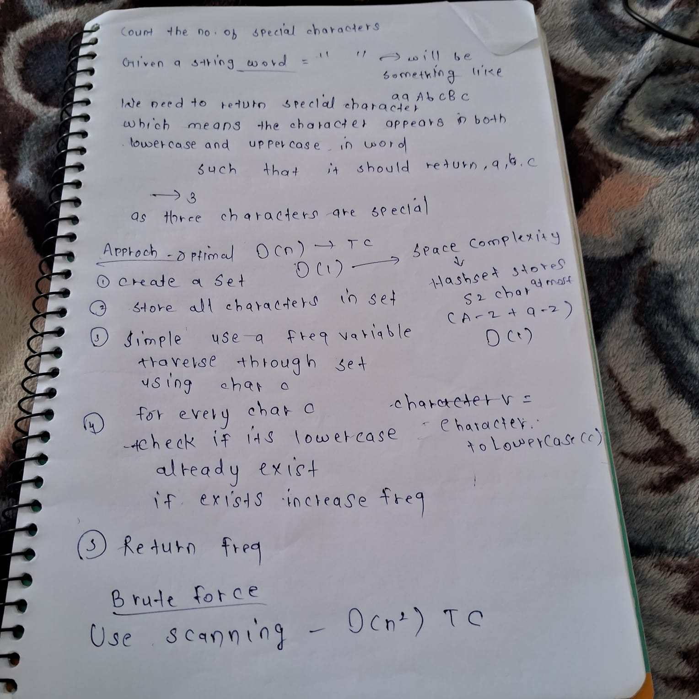

```java

class Solution {
    public int numberOfSpecialChars(String word) {
        Set<Character> arr=new HashSet<>();
        for(int i=0;i<word.length();i++){
            arr.add(word.charAt(i));
        }
        int freq=0;
        for(char c:arr){
            char v=Character.toLowerCase(c);
            if(c>='A' && c<='Z'){
               if(arr.contains(v)){
                freq++;
               }
            }
        }
            return freq;
        
    }
}
```


